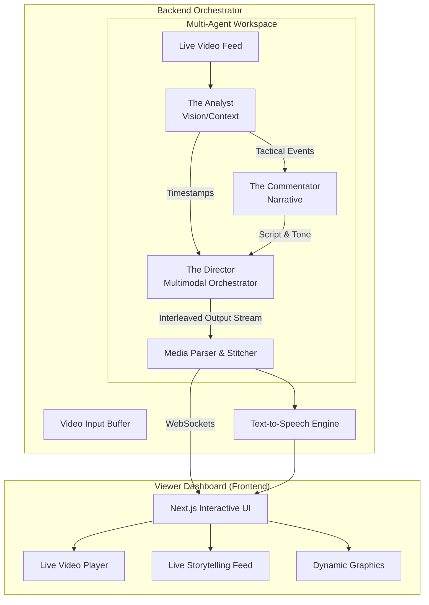

# The AI Director's Box 🎬⚽

**The AI Director's Box** is an experimental, fully autonomous AI-powered broadcast production suite built for the **Gemini API "Creative Storyteller" Competition**. Instead of just generating passive text, this system acts as a real-time commentator, analyst, and creative director for live sports.

It deeply leverages the native multimodal and interleaved capabilities of Google's Gemini models to watch a video feed and weave together a rich, mixed-media "Match Story" containing:
- **Spoken, persona-driven audio commentary** generated dynamically via Google Cloud Text-to-Speech (Journey voices).
- **AI-Generated Tactical Visuals** dynamically rendered over the video as Mermaid.js SVG overlays.
- **Interactive Match Storybooks** featuring a comprehensive post-match newspaper recap drafted by Gemini 2.5 Flash and a photo-realistic illustration generated entirely by **Vertex AI Imagen 3**.
- Highlight video clips and sentiment-driven content.

---

## 🏆 Submission Quick Links
- **[Submission Draft & Findings](.gemini/antigravity/brain/23172d17-113f-4d6c-be67-ee0601b22fb9/submission_draft.md)**
- **[Architecture Diagram](#architecture--the-multi-agent-system)**
- **[Proof of GCP Deployment](deployment_guide.md)**

---

## 🧠 The Core Concept: Gemini Interleaved Output

The magic of this project lies in its **Creative Storyteller** approach. The core orchestration agent utilizes Gemini's native capabilities to stream a cohesive multimedia response natively. A single streaming AI broadcast loop might look like:

> *"What a blistering counter-attack by the blues! Look at the space opening up on the right flank."*
> `[Directive: Render Tactical Diagram for Right-Wing Overload via Mermaid.js]`
> *"He chips it over the keeper... and IT'S IN! Absolute scenes!"*
> `[Directive: Clip Video Highlight 12:04-12:15]`
> `[Directive: Compile Match Recap and trigger Imagen 3 generation]`

---

## 🏗️ Architecture & The Multi-Agent System

To handle the immense complexity of watching video, analyzing tactics, writing creative commentary, and directing a live UI, the workload is distributed across a specialized **Multi-Agent System** hosted on Google Cloud.

### The Agents

1. **The Analyst (Gemini 1.5 Pro - Vision & Context)**
   - **Role**: The eyes of the operation.
   - **Function**: Continuously watches the live video feed (or frame samples) and extracts raw tactical data. Tracks player movement, identifies key events (goals, fouls), and maintains the raw tactical state of the match.
2. **The Commentator (Gemini 1.5 Flash - Narrative & Persona)**
   - **Role**: The voice of the match.
   - **Function**: Receives data from the Analyst, applies a specific persona (e.g., "Excited Brazilian Narrator," "Dry British Pundit"), and generates the emotive commentary text and audio tone markers.
3. **The Director (Gemini 1.5 Pro - Orchestration & Multimodal)**
   - **Role**: The creative visionary.
   - **Function**: Takes the timestamp events and the commentary script, and uses **Gemini's interleaved capabilities** to weave them together with visual overlay commands (e.g., when to pop up a player card or highlight clip) into a single, cohesive "Match Story" stream.
4. **The Producer (Gemini 1.5 Flash - Social & Recap)**
   - **Role**: The social media manager.
   - **Function**: Runs asynchronously monitoring the Match Story to draft engaging Tweet threads, Reel descriptions, and storyboard match recaps.

### System Flow Diagram



---

## 💻 Tech Stack

- **Backend AI Engine**: Node.js (TypeScript), Express.js
- **Frontend Dashboard**: Next.js (App Router), React, TailwindCSS
- **Real-time Communication**: WebSockets (`ws`)
- **Core AI Models**: Google Vertex AI (`@google/genai` SDK), Gemini 1.5 Pro & Flash
- **Media Manipulation**: FFmpeg (via `fluent-ffmpeg`), OpenCV (planned)

---

## 🚀 Getting Started (Local Development)

To run the sandbox locally, you need to spin up both the backend orchestrator and the Next.js viewer dashboard.

### Prerequisites
- **Node.js** (v18+)
- **Google Cloud Project** with **Vertex AI API** enabled.
- A **Service Account JSON** with Vertex AI User permissions.
- **FFmpeg** installed on your system PATH (for media clipping).

### 1. Start the Backend (The Director)
```bash
cd backend
npm install
```

Configure environment in `backend/.env`:
```env
GOOGLE_APPLICATION_CREDENTIALS=credentials.json
GOOGLE_CLOUD_PROJECT=your-gcp-project-id
GOOGLE_CLOUD_LOCATION=us-central1
PORT=9090
```
*(Ensure your service account JSON is placed at `backend/credentials.json`)*

Run the server:
```bash
npm run dev
```

### 2. Start the Frontend (The Viewer Dashboard)
Open a new terminal session.
```bash
cd frontend
npm install
npm run dev
```
Navigate to [http://localhost:3000](http://localhost:3000) in your browser. You should see the dashboard successfully establish a WebSocket connection to the backend.

### 3. Spin-up Verification
To ensure the project is reproducible for judges:
1. Ensure `.env` files are present in both `frontend` and `backend` (see examples above).
2. Place a valid `credentials.json` in the `backend/` folder.
3. Start Backend: `cd backend && npm run dev`
4. Start Frontend: `cd frontend && npm run dev`
5. Upload a sports video clip via the UI to trigger the agent pipeline.

### Next Steps: Testing the Agents
To actually test the video analysis pipeline, you will need to place a sample sports video clip (`.mp4`) into the `backend/` directory and implement the specific Prompt chains for the agents defined above.